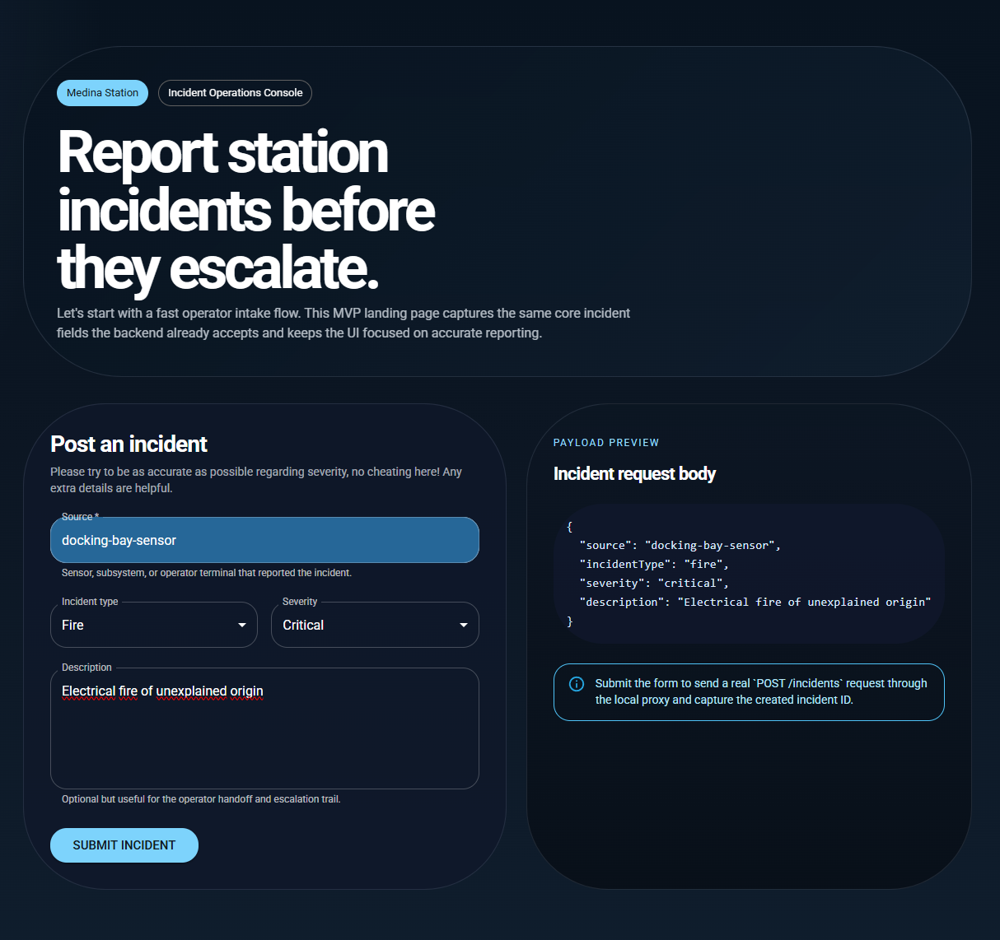
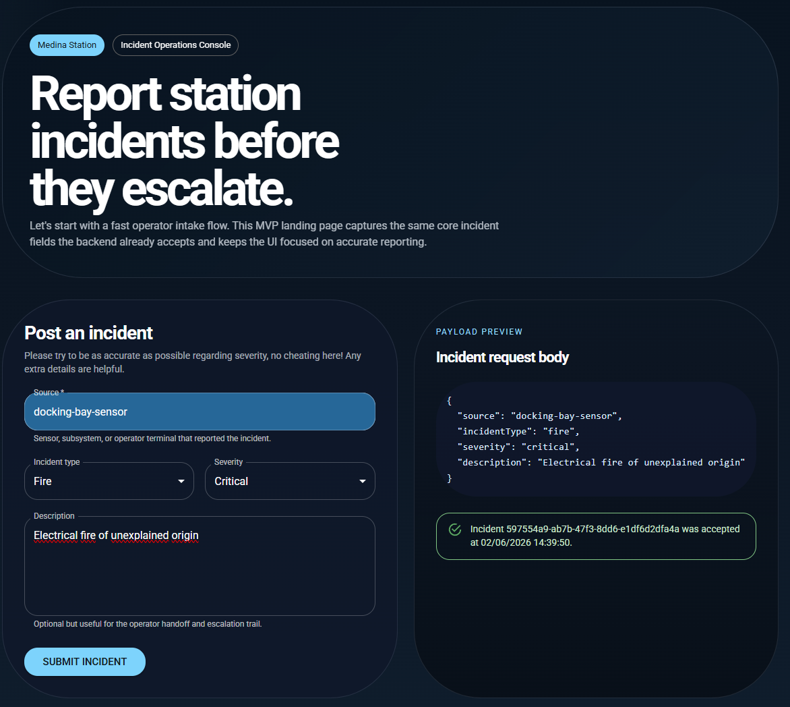

# Medina Incident React

Medina Incident React is a small React + Vite playground project that serves as the browser UI companion to Medina Incident Router.

The goal of this repository is not to present a finished production application. It is a focused frontend sandbox for experimenting with operator-facing workflows on top of the serverless backend, validating UI ideas quickly, and documenting the architectural decisions needed to connect a browser app to the existing API safely.

## Relationship to Medina Incident Router

This frontend is designed to work with the Medina Incident Router backend project.

Backend repository: https://github.com/ben-roadley/medina-incident-router

That backend exposes an incident API backed by API Gateway, Lambda, EventBridge, and DynamoDB. This frontend currently targets the backend's incident creation flow and is shaped around the same request payload used by `POST /incidents`.

At the moment, the UI is intentionally narrow. It focuses on the first operator workflow that makes the whole system tangible in the browser: reporting a new incident.

## Current Functionality

The first implemented feature is a landing page with incident submission.

Current MVP behavior:

- Branded landing page for the Medina incident console
- Incident reporting form using MUI components
- Fields aligned with the backend request contract: `source`, `incidentType`, `severity`, `description`
- Client-side validation for required input
- Live payload preview before submission
- Real submission to the backend `POST /incidents` endpoint
- Success and error feedback in the UI

This gives the project a concrete end-to-end slice: a browser-based operator can fill in an incident form locally and submit it to the deployed backend.

### Screenshots

Landing page and incident submission form:



Successful incident submission:



## Why the API Call Uses a Vite Proxy

For local development, this project uses the Vite dev server as a proxy to the deployed API instead of calling API Gateway directly from the browser.

That decision was made for two reasons:

1. The current backend uses a shared-token custom authorizer.
2. Shipping that token directly to browser code would expose it to the client.

With the current setup, the browser sends requests to the local Vite server at `/api/...`, and Vite forwards those requests to the real API Gateway endpoint while attaching the `Authorization` header on the server side.

This approach lets the frontend query the production backend during development without embedding the secret token into the React bundle.

This is a local-development convenience, not a production auth strategy.

## Local Development Setup

### Prerequisites

- Node.js 22 or newer recommended
- npm
- A running Medina Incident Router deployment
- A valid backend auth token for local development

### Install dependencies

```bash
npm install
```

### Configure environment variables

Create a `.env.local` file in the root of this repository.

You can copy the values from `.env.example` and fill in the real backend settings:

```env
MEDINA_API_BASE_URL=https://your-api-id.execute-api.your-region.amazonaws.com/Prod
MEDINA_API_AUTH_TOKEN=replace-with-your-token
```

### Start the app

```bash
npm run dev
```

By default, the app runs on `http://localhost:5173`.

### Build the app

```bash
npm run build
```

## How Local API Submission Works

When the form is submitted during local development:

1. The React app sends a `POST` request to `/api/incidents`.
2. The Vite proxy forwards that request to the configured API Gateway base URL.
3. The proxy injects the backend `Authorization` header using `MEDINA_API_AUTH_TOKEN`.
4. The frontend sends the backend-compatible JSON body along with an `x-idempotency-key` header.
5. The API returns the created `incidentId`, which is then shown back in the UI.

This keeps the token out of browser code while preserving a realistic end-to-end flow.

## Production Readiness Gaps

This project is intentionally not production-ready yet.

The main gaps are architectural rather than cosmetic:

- The current Vite proxy approach is only appropriate for local development.
- The backend auth model is not browser-safe because it relies on a shared secret token.
- API Gateway CORS is not yet configured for a hosted browser client.
- There is no deployed frontend hosting setup yet.
- Error handling and user guidance are still basic.
- The UI only covers incident creation, not the broader operator workflow.
- There is no test suite yet for frontend behavior.
- Environment handling and deployment conventions still need to be formalized.

To make this production-ready, the likely next backend/frontend platform tasks would be:

- Replace the shared-token pattern with a browser-safe auth solution such as Cognito, IAM-based access, or a backend-for-frontend layer
- Add API Gateway CORS configuration for the hosted frontend origin
- Define deployment and hosting for the frontend, for example S3 + CloudFront or AWS Amplify
- Add frontend testing and stronger form/error-state coverage
- Expand the UI beyond the initial submission flow

## Tech Stack

- React
- Vite
- MUI
- Fetch API for backend calls

## Project Status

This repository is in active playground mode.

Implemented:

- Landing page for the incident console
- Incident submission form
- Local development proxy to the deployed backend
- End-to-end incident creation against Medina Incident Router

Planned next features:

- Incident lookup view for `GET /incidents/{id}`
- Incident acknowledgment flow for `POST /incidents/{id}/ack`
- Connection-state feedback when proxy configuration is missing or invalid
- Better operator feedback around loading, failure, and returned incident state
- A broader incident operations console beyond the initial landing page

## Notes

This repository is intentionally small and incremental. The point is to make integration decisions visible, not to hide them behind a large frontend abstraction too early.
